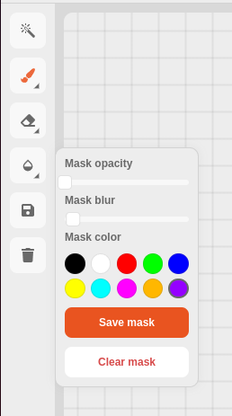
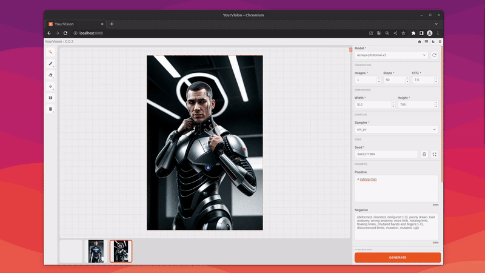
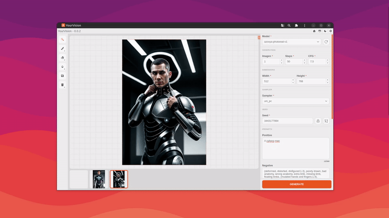
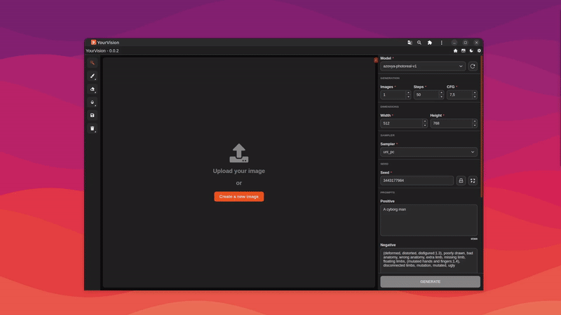
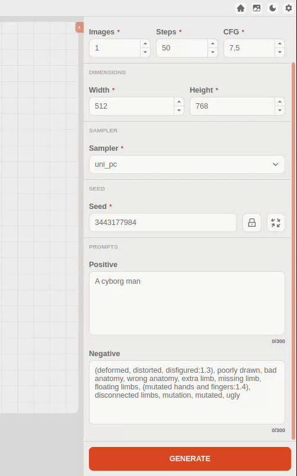

  

# <b>YourVision</b>:  AI-powered image editor

  

# Application features

  
Smart Mask with Segment Everything

  
Configurable editing tools

  

    
  

  
Optimized for desktop and mobile

  

    
  

  
Dark theme support

  

    
  

  
Gallery with the generated images

  

    
  

  
Plugin support

  

    
  

  ## Some plugins are already available:

  - [ControlNet](https://github.com/obraia/yv_controlnet_plugin)
  - [CodeFormer Face Restoration](https://github.com/obraia/yv_codeformer_plugin)
  - [GFPGAN Face Restoration](https://github.com/obraia/yv_gfpgan_plugin)
  - [LoRA](https://github.com/obraia/yv_lora_plugin)

# Instalation

First, you will need python v3.10.6 and nodejs v18.16.0 with yarn.

1. Clone the repository with: 

        git clone https://github.com/obraia/YourVision.git

0. Create and active a python development environment with:

        python -m venv venv
        source .venv/bin/activate or .venv/bin/activate (windows)

0. Install the python dependencies with:

        pip install -r requirements.txt

0. Install pytorch for your system NVIDIA/AMD GPU or CPU:

    NVIDIA GPU:

        pip install torch torchvision torchaudio --extra-index-url https://download.pytorch.org/whl/cu117

    AMD GPU (only linux for now)

    ``Obs: You will need the latest version of ROCm installed on your linux``

        pip install torch torchvision torchaudio --extra-index-url https://download.pytorch.org/whl/rocm5.4.2

    CPU

        pip install torch torchvision torchaudio --extra-index-url --extra-index-url https://download.pytorch.org/whl/cpu

0. You will need to convert .ckpt or .safetensors checkpoints to diffusers with the following command:

        python scripts/convert_original_stable_diffusion_to_diffusers.py --checkpoint_path "path/to/checkpoint.ckpt" --original_config_file "api/weights/sd/inferences/<inference>.yaml" --dump_path "api/weights/sd/diffusers/<diffusers-name>/" --device="cuda:0"

0. Now run the api with:

        python api/app.py

0. To install the front-end dependencies:

        cd gui/ & yarn install

0. And start the application:

        yarn start

# Features to be implemented in the future

- [ ] Install script
- [ ] Auto conversion of .ckpt and .safetensors models
- [ ] Translation support (Interface and Prompts)
- [ ] Page with application settings
- [x] Generated images gallery
- [ ] Creation of shortcuts for the interface
- [ ] Support for predefined generation filters
- [x] Create layer system
- [x] Plugins support

# Credits

- Diffusers: https://github.com/huggingface/diffusers
- Segment Anything: https://github.com/facebookresearch/segment-anything